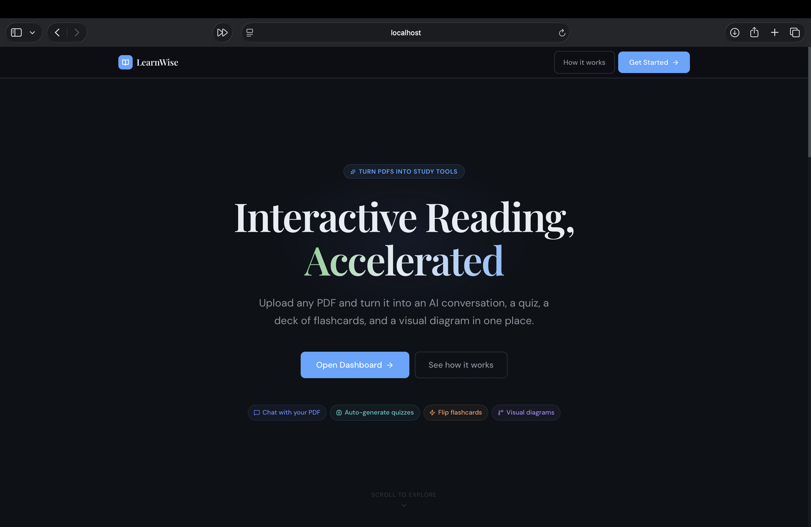
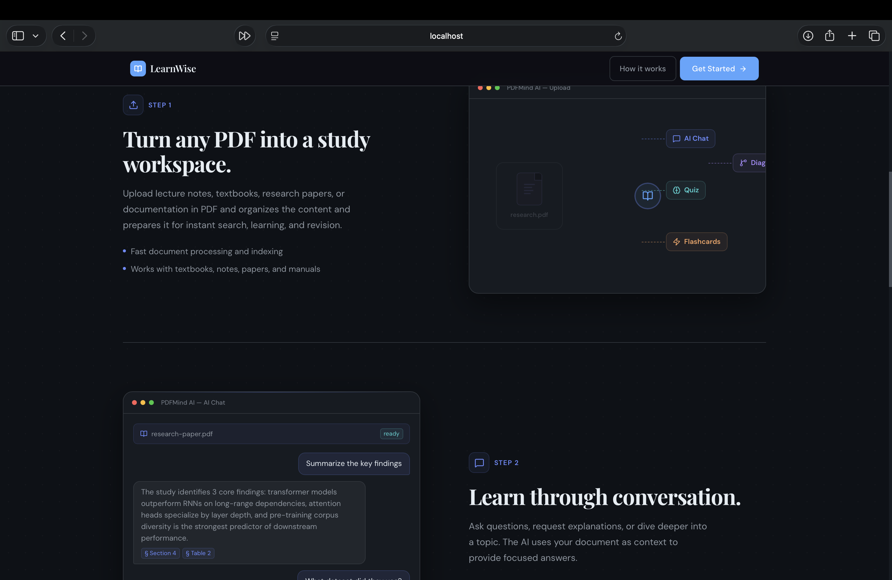
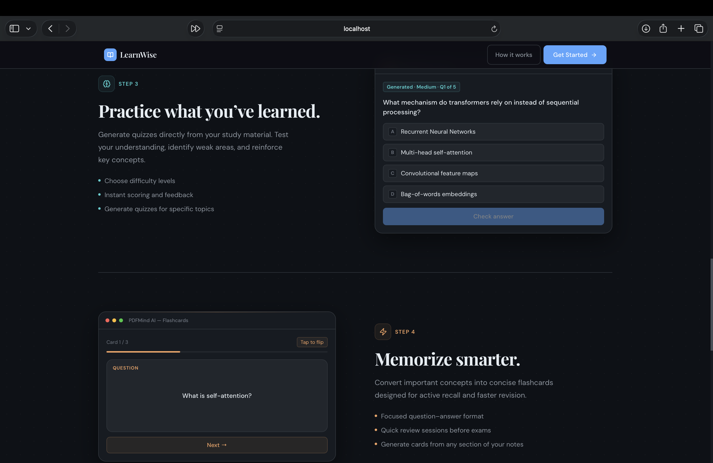
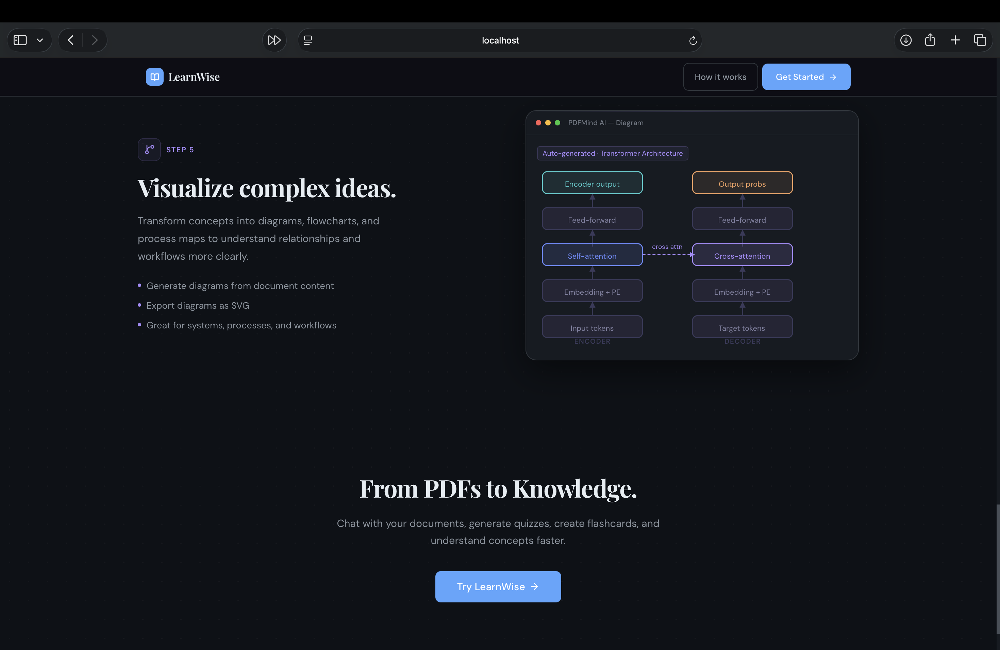
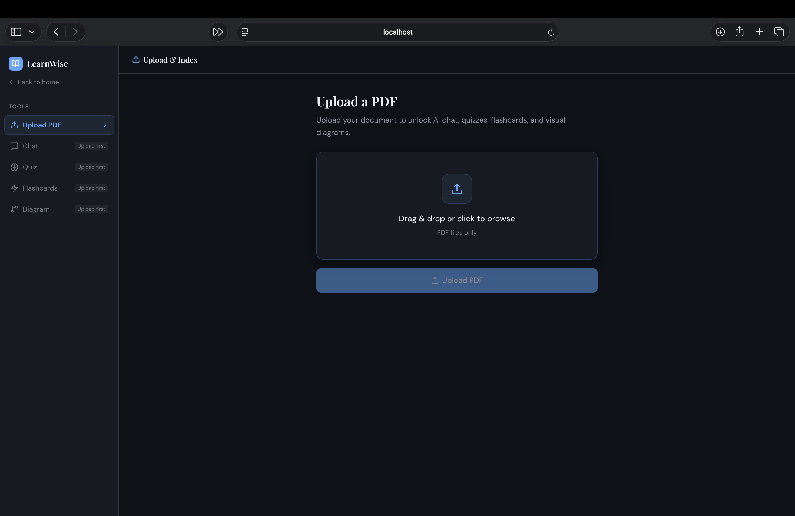
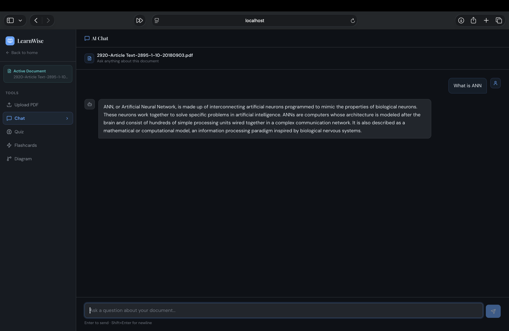
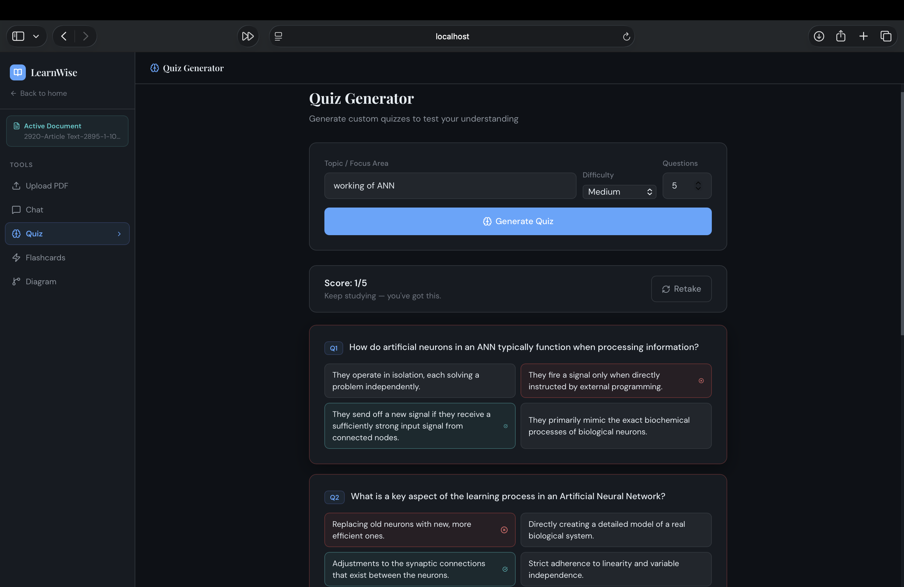
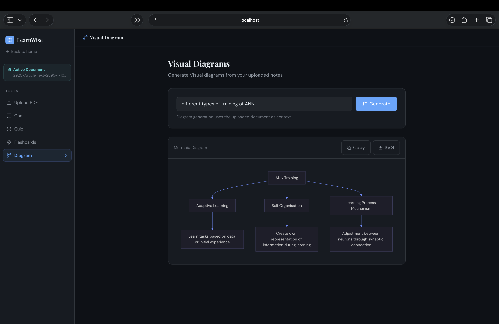

# LearnWise

An AI-powered study copilot that transforms PDFs into interactive learning experiences.

Upload lecture notes, textbooks, research papers, or documentation and instantly:

* Chat with your documents
* Generate quizzes
* Create flashcards
* Visualize concepts with Mermaid diagrams

Built using FastAPI, FAISS, Sentence Transformers, Gemini LLMs, and React.

---
## Screenshots

### Landing Page






### Upload PDF



### AI Chat



### Quiz Generation



### Flashcards


### Diagram Generation



---

## Features

### AI Chat (RAG)

Ask questions about uploaded PDFs and receive document-grounded answers using Retrieval-Augmented Generation (RAG).

### Quiz Generation

Generate multiple-choice quizzes from document content.

* Topic-based quizzes
* Difficulty selection
* Instant evaluation

### Flashcards

Automatically create flashcards for active recall and revision.

### Mermaid Diagram Generation

Convert concepts into visual diagrams and flowcharts.

* Mermaid.js support
* SVG export
* Concept visualization

### Semantic Search

Instead of keyword matching, the platform uses vector embeddings and similarity search to retrieve relevant document sections.

---

## Architecture

Frontend (React)
↓
FastAPI Backend
↓
RAG Service
↓
FAISS Vector Store
↓
Sentence Transformers
↓
Gemini LLM

### RAG Pipeline

1. Upload PDF
2. Extract text
3. Create semantic chunks
4. Generate embeddings
5. Store vectors in FAISS
6. Retrieve relevant chunks
7. Inject context into prompt
8. Generate grounded response

---

## Tech Stack

### Frontend

* React
* Vite
* Axios
* Mermaid.js
* Lucide Icons

### Backend

* FastAPI
* Python

### AI & NLP

* Gemini API
* Sentence Transformers
* all-MiniLM-L6-v2

### Vector Database

* FAISS

### PDF Processing

* PyMuPDF (fitz)

---

## Project Structure

backend/
│
├── app/
│ ├── routes/
│ ├── services/
│ ├── models/
│ ├── db/
│ ├── utils/
│ ├── config.py
│ └── main.py
│
├── uploads/
├── vectorstores/
└── requirements.txt

frontend/
│
├── src/
│ ├── components/
│ ├── pages/
│ ├── context/
│ ├── api.js
│ └── App.jsx
│
└── package.json

---

## Installation

### Backend

```bash
cd backend

python -m venv venv

source venv/bin/activate

pip install -r requirements.txt

uvicorn app.main:app --reload
```

Backend runs at:

```text
http://localhost:8000
```

---

### Frontend

```bash
cd frontend

npm install

npm run dev
```

Frontend runs at:

```text
http://localhost:5173
```

---

## Environment Variables

Create a `.env` file inside the backend directory.

```env
GEMINI_API_KEY=your_gemini_api_key
```

---

## API Endpoints

### Upload PDF

```http
POST /upload
```

### Chat

```http
POST /chat
```

### Generate Quiz

```http
POST /quiz
```

### Generate Flashcards

```http
POST /flashcards
```

### Generate Diagram

```http
POST /diagrams
```

---

## Screenshots

### Landing Page

Add screenshot here.

### PDF Upload

Add screenshot here.

### AI Chat

Add screenshot here.

### Quiz Generation

Add screenshot here.

### Flashcards

Add screenshot here.

### Mermaid Diagram Generation

Add screenshot here.

---

## Future Improvements

* Authentication
* User profiles
* Learning analytics
* Progress tracking
* Multi-document workspaces
* ChromaDB / Pinecone support
* Spaced repetition flashcards
* Concept maps
* Collaborative study sessions

---

## Why This Project?

Most PDF chat applications stop at question answering.

PDFMind AI focuses on learning by combining retrieval, conversation, quizzes, flashcards, and visual explanations into a single study workflow.

